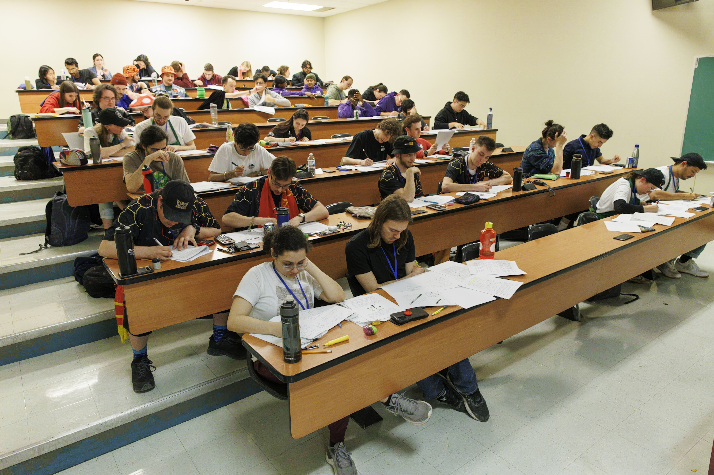
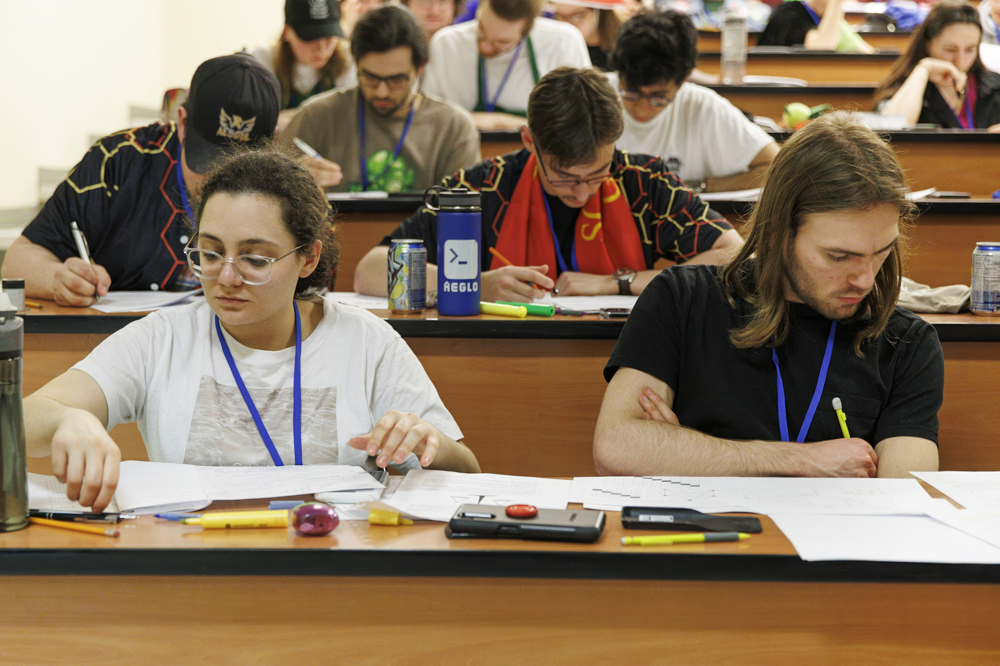
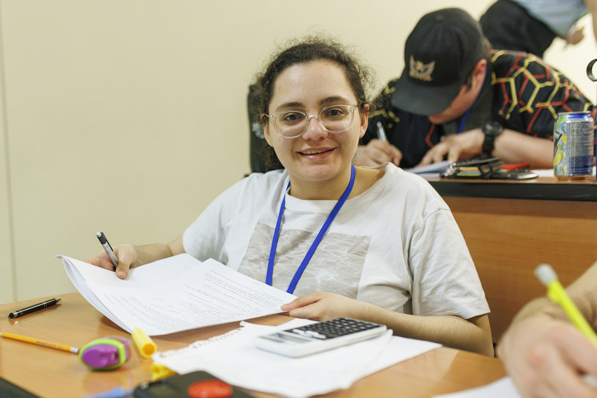
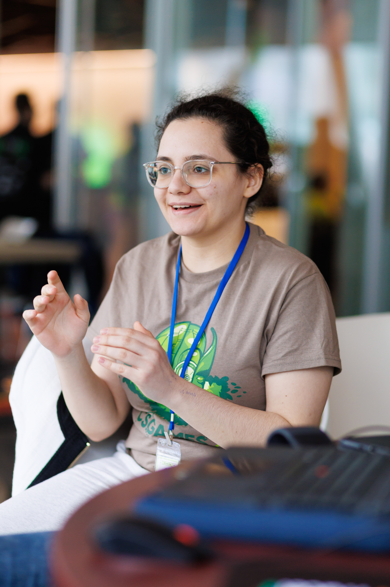
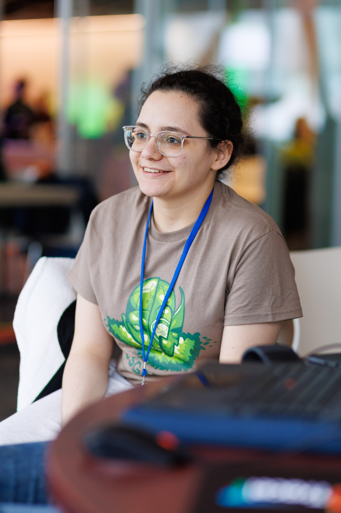
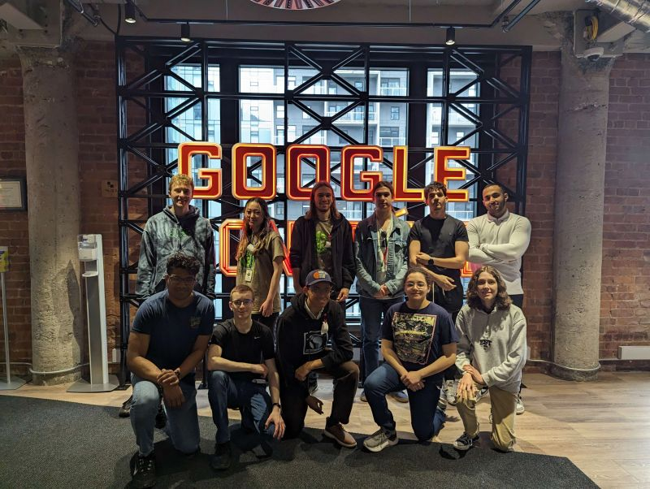

# CS Games 2024

CS Games is the the largest computer science competition in Quebec.

This was my first time travelling to Montreal for a Hackathon.

Honestly, I love the city. It's insane how lively it is at night. 

I participated in the Info-theo (Academic), High Performance Computing (Low-level computing and optimization), Extreme
Programming (Leetcode with no Internet / Error Logging), and Gaming challenges.

Big shout out to John to partnered with me for Info-theo and Extreme Programming challenges. I was kind of suprized at how well the info-theo challenge went, as we did no prep (and made our cheat sheet on our walk to the event room XD). We managed to place 4th overall; just missing the podium spot.

Big thank you to the CS Club and CSSA for sponsoring the trip, to Ecole de Technologie Supérieure (Montréal) for hosting us, and to the members of my team that convinced me to go on short notice. 

I also got to visit Google's headquarters.

