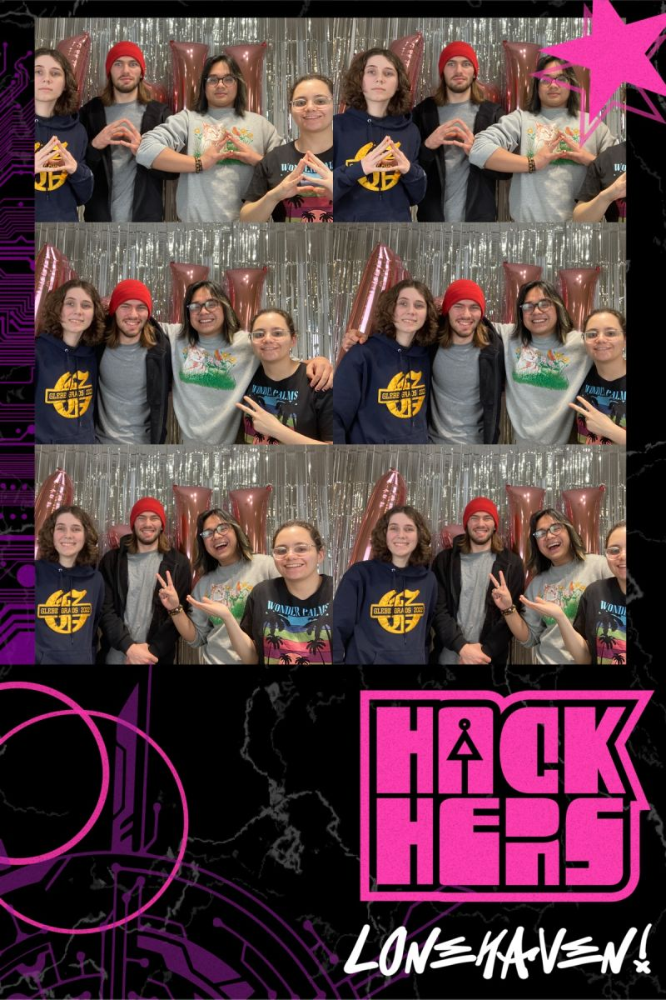

# Hack Hers 2024

Hosted on uOttawa's campus, Hack Hers was the first event of it's kind.

It was my first time actually working with hardware. I used an Arduino (C++), Raspberry Pi Pico, and a Pulse Oximeter Sensor MAX30100/30102 for heart rate detection and GY-521 MPU-6050 accelerometer and gyroscope to measure movement. 

My team tackled Challenge 2: Movement Tracker and developed SHE a SHockingly Effective Motivational Tool. 

The purpose was to motivate individuals to stay active by delivering a slight shock during periods of resting heart rate and inactivity. 

Overall, I had a good time.

