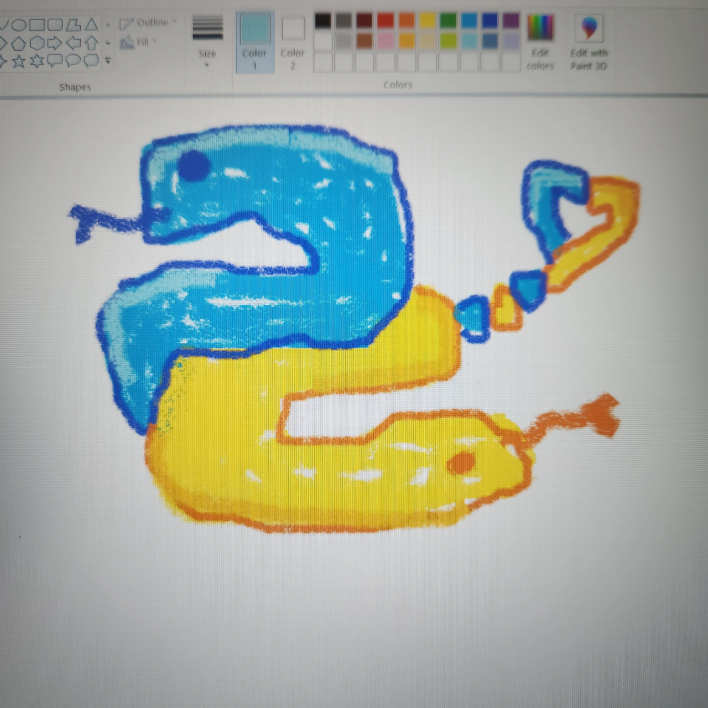

# Technolgap Hackathon

This was the first technolgap hackathon event at Carleton University and it was pretty fun!

My team managed to win 2nd place for the core challenge: Code For Empowerment.

I also won the logo-remix challenge by drawing the Python logo in Paint.

