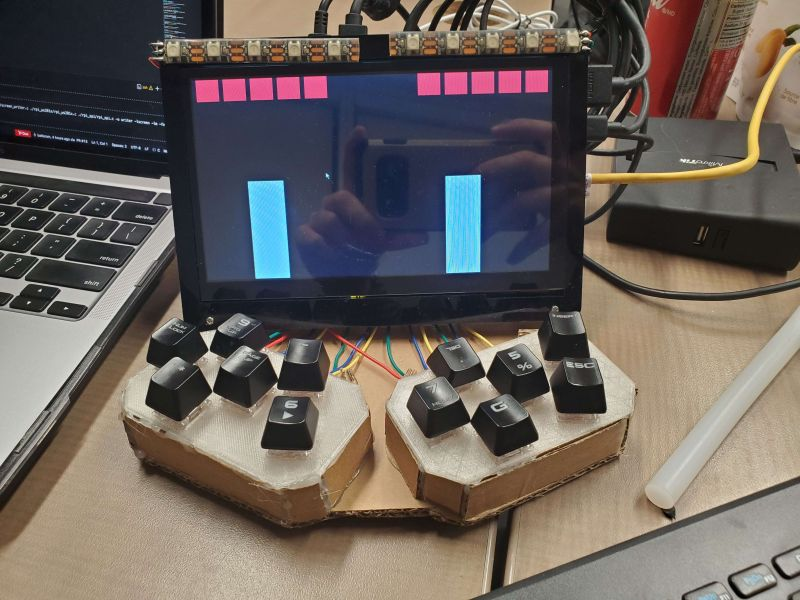
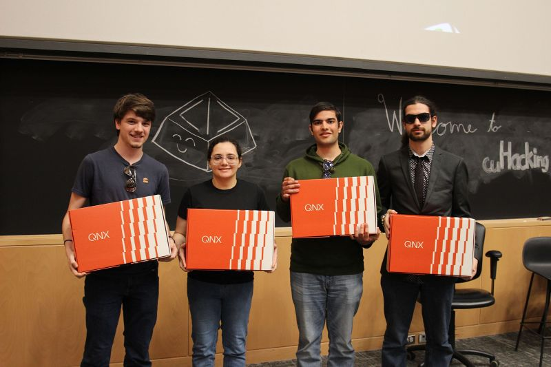
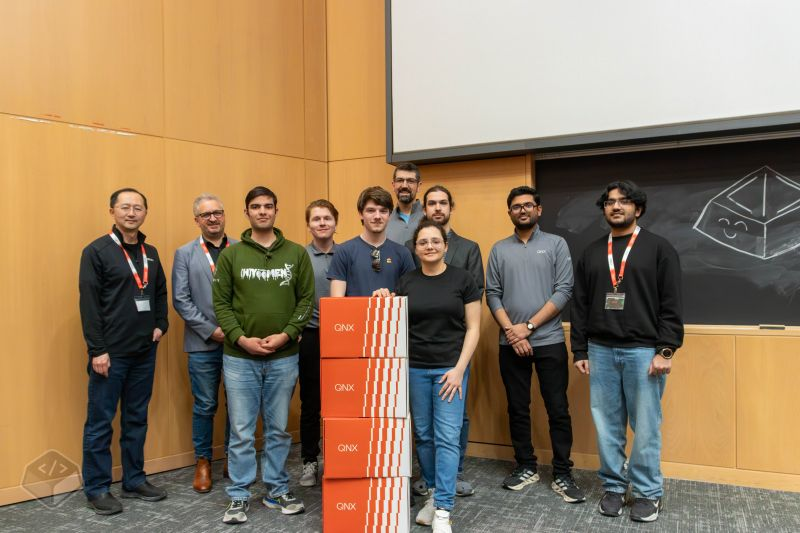

# cuHacking 6

Secured a 1st Place win for the QNX's hardware challenge.

We kept pivoting tech stacks and languages the entire 2 day event in order to actually make this a reality.

At some point around 2 am, we looked at eachother and were like "Nope not going to work". But, we refused to give up, pushed through the setbacks, and kept iterating until we found a solution.

The project altogether used C/C++/Python with libaries such as Ncurses, Raylib, and pygame and ran on a Raspberry Pi 4B running QNX OS.

