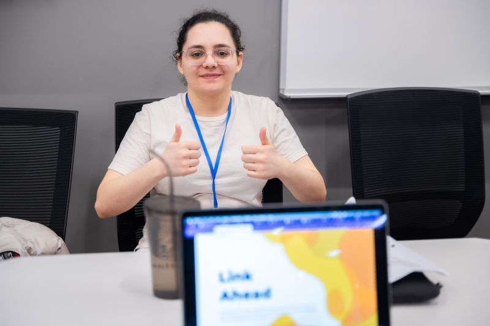

# uOttaHack 6

This was my first ever hackathon where I actually managed to submit a project.

The challenge was to use Machine Learning within your project with a focus on speed, accuracy, model size, and resource allocation.

I created Link Ahead, a chrome browser extension that warned you about phishing links before you click.

Even though my project didn't win, the experience I gained during the demo and project showcase phase was invaluable. I learned a lot from presenting my work, receiving feedback, and seeing what others built.

