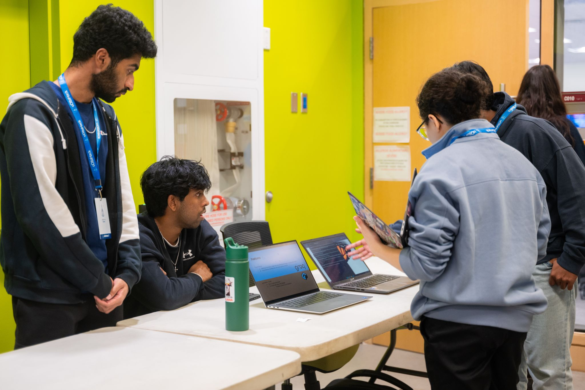
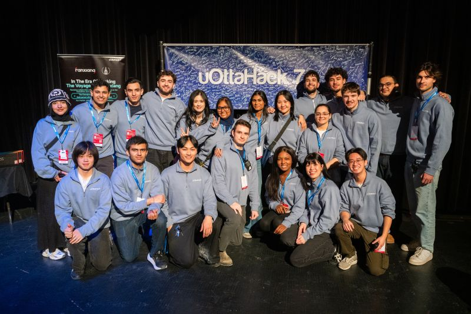
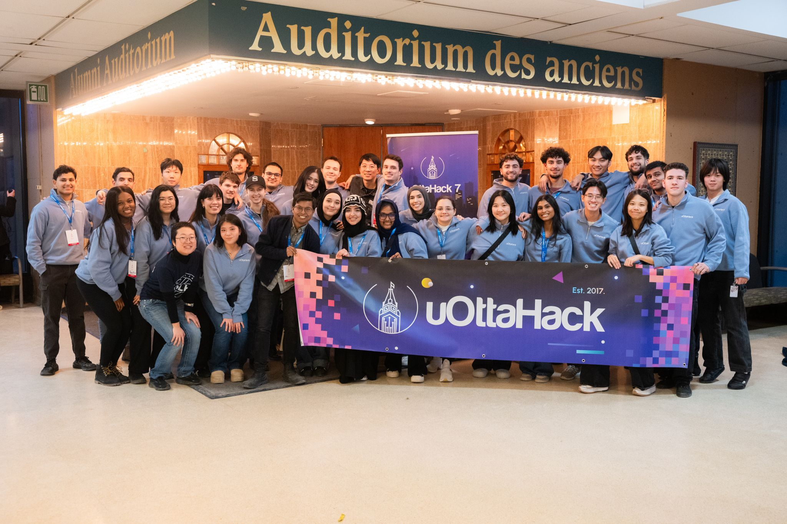

# uOttaHack 7

I had the privilege of helping organize uOttaHack 7, which turned out to be the biggest hackathon we've ever hosted at the University of Ottawa (with over 850 attendees).

This year, I focused on making sure communication flowed smoothly between organizers and hackers. I also helped plan and run community events for everyone at the hackathon, working to keep things on track and make sure people had a great time.

The event came together thanks to the hard work of all the organizers, sponsors, volunteers, and hackers.

A few personal highlights:
- Handled over 87 support tickets during the 36-hour event.
- Sent out more than 30 announcements and 300+ messages to participants.
- Worked alongside great mentors and volunteers, especially Christine and Wei He from Major League Hacking (MLH)!

