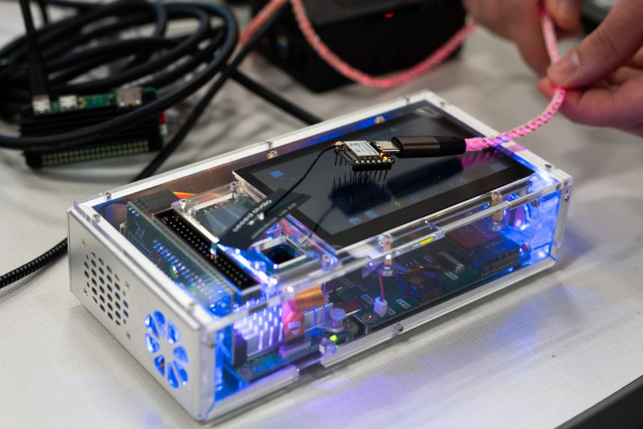
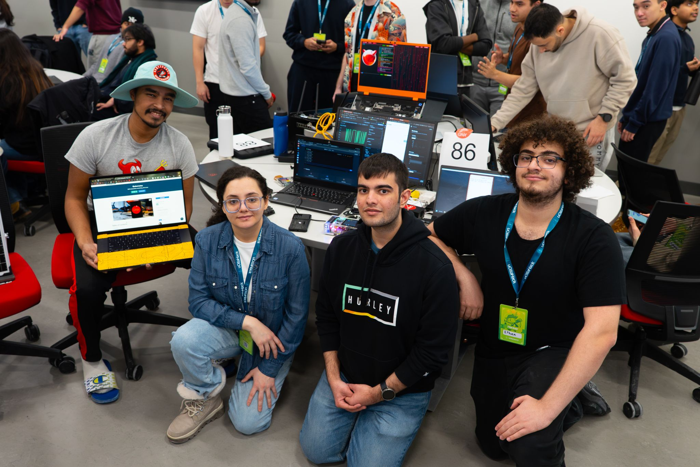
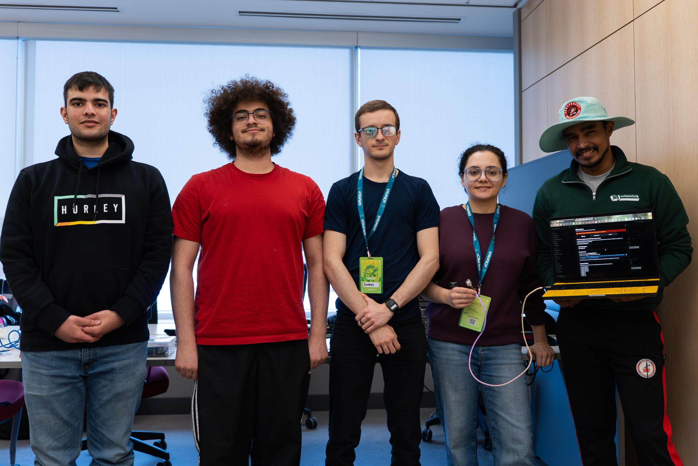

# uOttaHack 8

We set out to build the world’s smallest data center in 36 hours. 🤏⚡

We didn't walk away with a trophy this time, but we walked away with something cooler: Qubernetes.

Our goal was "hilarious and technically ludicrous"—we wanted to apply large-scale data center thinking to resource-constrained microcontrollers like ESP32s and Raspberry Pis. While everyone is focused on massive AI compute, we wanted to see if we could orchestrate workloads on devices with less storage than a single JPEG.

The technical stuff:
- Wrote firmware for ESP32s to act as "deployable units".
- Cross-compiled and ported a Rust-based Minecraft server (Oxide) to run on QNX RTOS.
- Actually played Minecraft on it.
- Set up Grafana and Dokploy for container orchestration.

The hardware definitely humbled us. When you only have 8-16MB of flash, you can't "just add dependencies". We dealt with overheating Pi Zeros, network debugging nightmares, and the strict constraints of embedded systems.

My biggest takeaway? Code is a liability, not an asset. Leveraging existing tools like Docker Compose allowed us to focus on the impossible parts rather than reinventing the wheel.

Huge shoutout to my teammates: Surya Vasudev, Mumtahin Farab and Ethan Michael, for grinding through the QNX docs with me! Also thanks to Justin Scaffidi for the QNX debugging help.

